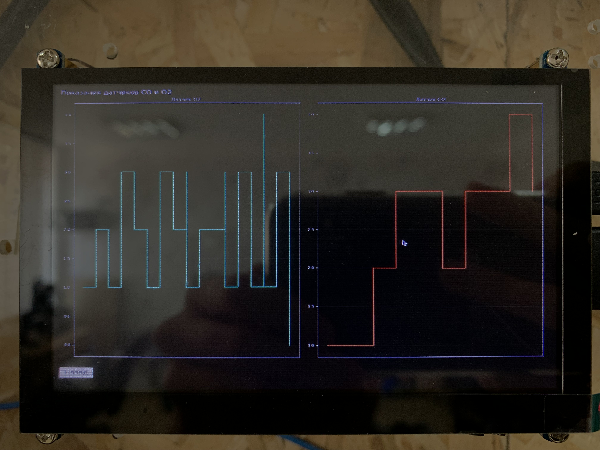
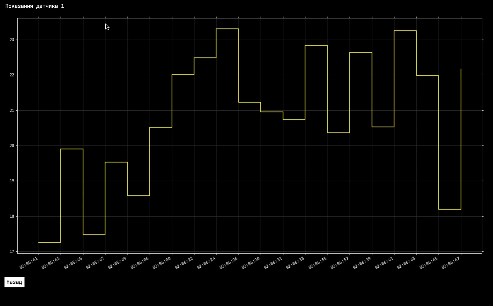
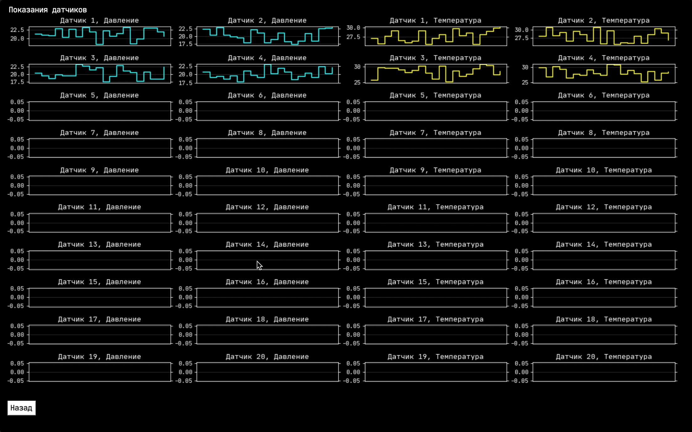

This is a logger tool for displaying data from several devices with sensors (20 temperature + 20 pressure total), saving their values in CSV file. 

The data is shown in graphs and digital immediate values. The tool also allows to show data from saved logs by selecting a date and time frame.

Communication with the devices is done via serial interface.

Prerequisites: Python 3, PySimpleGUI, pyserial, matplotlib

